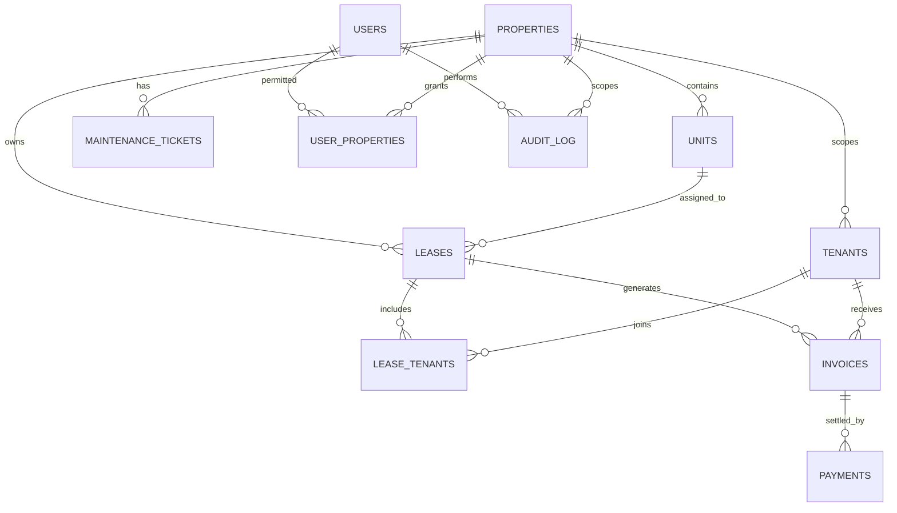

# NivasaOS

**Open-source, self-hosted property operations for boarding houses, apartments, and rentals.**

NivasaOS gives an owner or rental team one place to manage multiple properties, units, availability, tenants, leases, invoices, payment proofs, arrears, WhatsApp reminders, maintenance work, role-based access, and property-scoped reports.

> Built by [Aahav Labs](https://aahavlabs.in) · hi@aahavlabs.in

## Why NivasaOS

Many small and mid-sized rental operations outgrow spreadsheets before they are ready for expensive, vendor-locked property software. NivasaOS is designed as a practical local-first MVP:

- no hosted database account;
- no mandatory payment gateway;
- no mandatory messaging vendor;
- no telemetry or SaaS lock-in;
- one SQLite database and a local uploads directory;
- extension registries for payment methods, notification drivers, settings, and dashboard sections.

Application packages such as Next.js and React are required, but the running product has **no mandatory third-party hosted service dependency**.

## Included today

### Portfolio and occupancy

- Multiple properties with independent currency and status.
- Boarding house, apartment, rental, and mixed property types.
- Units with type, floor, capacity, monthly rate, deposit, notes, and availability.
- Live available, occupied, maintenance, and inactive states.
- Secure property and unit editing with financial and lease-integrity guards.

### Tenants and leases

- Tenant contact, identity, emergency, address, and lifecycle records.
- Fixed-term or open-ended leases.
- One or multiple tenants per lease for shared accommodation.
- Configurable billing day, rent, deposit, and notes.
- Move-in automatically occupies the unit.
- Move-out ends the lease, releases the unit, and preserves history.
- Tenant contact, identity, emergency, address, and lifecycle details remain editable without breaking historical links.

### Invoices and collections

- Idempotent monthly rent runs for all accessible properties or one selected property.
- Rent or ad-hoc invoices.
- Issued, part-paid, paid, draft, void, and computed overdue states.
- Search and filters by property, status, invoice, tenant, lease, or unit.
- Payment ledger with method, reference, date, notes, and recorder.
- Invoice-linked payments update balances atomically.
- Local JPG, PNG, WebP, or PDF proof uploads up to 5 MB.
- Proof files are served only after authentication and property-access checks.

### WhatsApp reminders

- Pre-filled WhatsApp click-to-chat reminders from overdue or open invoices.
- Editable reminder template with tenant, invoice, balance, and due-date variables.
- Reminder preparation is logged.
- The default driver does not require a WhatsApp Business API account.

For automatic sending, register a WhatsApp Cloud API or another notification driver through the extension layer.

### Maintenance

- Reported → In progress → Resolved workflow.
- Property, unit, tenant, priority, and staff assignment.
- Responsive operational board.

### Roles and reports

- **Owner:** full portfolio, team, settings, and audit-log control.
- **Admin:** operational management for assigned properties.
- **Staff:** day-to-day tenant, invoice, payment, and maintenance access for assigned properties.
- Property-scoped dashboard metrics, rent-run readiness, and upcoming lease-expiry follow-up.
- Occupancy, collection, and arrears reports.
- Editable admin/staff roles and property assignments.
- Owner-only audit log with actor, action, record, property, and safe change metadata.

## Technology

- Next.js 16 App Router
- React 19
- Bun runtime and package manager
- Bun's built-in `bun:sqlite`
- Server Actions for mutations
- Local filesystem uploads
- Plain responsive CSS with no UI-kit dependency
- Docker and Docker Compose

## Quick start with Bun

Requirements: Bun 1.3+ and a modern Linux, macOS, or Windows/WSL environment.

```bash
git clone https://github.com/smeetbuilds/nivasaos.git
cd nivasaos
cp .env.example .env.local
bun install
bun run dev
```

Open `http://localhost:3000`. The first-run installer will:

1. initialise the SQLite schema;
2. create the first owner account;
3. save portfolio defaults;
4. optionally add two sample units;
5. sign the owner in.

For a production build:

```bash
bun run build
bun run start
```

Bun must execute the Next.js CLI because NivasaOS uses `bun:sqlite`:

```json
{
  "scripts": {
    "dev": "bun --bun next dev",
    "build": "bun --bun next build",
    "start": "bun --bun next start"
  }
}
```

## Docker

```bash
docker compose up -d --build
```

Then open `http://localhost:3000`.

The Compose file persists both the SQLite database and payment proofs in the `nivasa_data` volume. Put a reverse proxy such as Caddy, Nginx, or Traefik in front of the container for HTTPS.

## Environment variables

| Variable | Default | Purpose |
|---|---|---|
| `NIVASA_DB_PATH` | `./storage/nivasaos.sqlite` | SQLite database location |
| `NIVASA_UPLOAD_DIR` | `./storage/uploads` | Payment proof directory |
| `NEXT_PUBLIC_APP_URL` | `http://localhost:3000` | Canonical application URL |

## Backup and restore

Back up these together while writes are paused or through a SQLite-safe backup process:

```text
storage/nivasaos.sqlite
storage/nivasaos.sqlite-wal   # when present
storage/nivasaos.sqlite-shm   # when present
storage/uploads/
```

A basic filesystem backup example:

```bash
docker compose stop nivasaos
tar -czf nivasaos-backup-$(date +%F).tar.gz storage/
docker compose start nivasaos
```

When using the named Docker volume, use your container platform's volume-backup workflow instead of the host `storage/` example.

## Extension architecture

The core registry is in `lib/extension-registry.js`. The loader is `lib/extensions.js`, and the intended custom-code entrypoint is `plugins/index.js`.

### Add a payment method

```js
import { registerPaymentMethod } from "@/lib/extension-registry";

registerPaymentMethod({
  id: "razorpay_manual",
  label: "Razorpay"
});
```

### Add a notification driver

```js
import { registerNotificationDriver } from "@/lib/extension-registry";

registerNotificationDriver({
  id: "whatsapp_cloud",
  label: "WhatsApp Cloud API",
  async prepare({ recipient, message, context }) {
    // Validate settings, send through your adapter, and return a stable result.
    return { status: "sent", providerMessageId: "..." };
  }
});
```

The registry exposes four extension surfaces:

- `registerPaymentMethod()`
- `registerNotificationDriver()`
- `registerDashboardSection()`
- `registerSettingsSection()`

Keep provider credentials out of source control. A production provider extension should encrypt secrets at rest, handle retries idempotently, validate webhooks, and maintain an auditable event log.

## Data model



## Security baseline

Implemented:

- scrypt password hashing with a unique salt;
- random session tokens stored as SHA-256 hashes;
- HTTP-only, SameSite=Lax session cookie;
- role checks on privileged mutations;
- property-access checks on property-owned records;
- SQLite foreign keys and constrained statuses;
- prepared SQL statements;
- payment amount and invoice-balance validation;
- proof MIME type, size, generated filename, and authenticated delivery checks;
- disabled accounts have active sessions revoked;
- actively leased units and tenants cannot be moved into contradictory lifecycle states;
- property currency is locked after financial activity;
- sensitive operational mutations are written to the owner-only audit log without passwords or proof contents.

Before internet-facing deployment:

- terminate HTTPS at a trusted reverse proxy;
- restrict access to the database and upload volume;
- patch Bun and application dependencies regularly;
- use strong unique passwords;
- configure rate limiting at the proxy for `/login`;
- establish tested encrypted backups;
- review privacy, retention, tax, tenancy, and messaging requirements for your jurisdiction.

See [SECURITY.md](SECURITY.md) for vulnerability reporting.

## Current MVP boundaries

NivasaOS is usable for local/manual rental operations, but these are intentionally not claimed as complete yet:

- monthly rent runs are initiated manually rather than executed by a scheduler;
- the default WhatsApp integration opens click-to-chat rather than sending automatically;
- payment gateway settlement and webhook reconciliation require an extension;
- lease document generation and e-signatures are not included;
- SQLite is best suited to a single application instance or carefully coordinated storage, not horizontally scaled multi-writer deployment.

## Suggested roadmap

- optional scheduled rent-run automation with dry-run previews;
- late fees and configurable grace periods;
- lease PDF templates and document attachments;
- tenant portal and receipts;
- automatic WhatsApp/email/SMS drivers;
- gateway plugins and webhook reconciliation;
- import/export and richer CSV reports;
- PostgreSQL adapter for larger multi-instance deployments;
- extension discovery and lifecycle management.

## Contributing

Read [CONTRIBUTING.md](CONTRIBUTING.md). Keep every query property-scoped, every financial mutation auditable, and every provider integration idempotent.

## License

MIT. See [LICENSE](LICENSE).

---

**NivasaOS is built by [Aahav Labs](https://aahavlabs.in).**
Product and engineering enquiries: **hi@aahavlabs.in**
