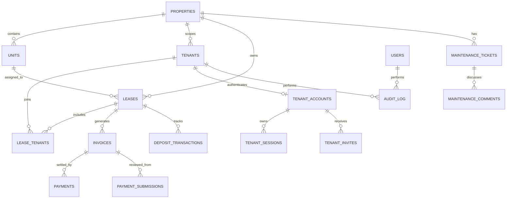

# NivasaOS

**Open-source, self-hosted property operations for boarding houses, apartments, and rentals.**

NivasaOS gives owners and rental teams one place to manage properties, units, availability, tenants, leases, invoicing, rent collection, payment proofs, refundable deposits, maintenance, reminders, reports, staff access, and a secure resident portal.

> Built by [Aahav Labs](https://aahavlabs.in) · hi@aahavlabs.in

## Why NivasaOS

Small and mid-sized rental operations often outgrow spreadsheets but do not want a vendor-locked SaaS. NivasaOS keeps the core local:

- SQLite database;
- local authenticated uploads;
- no mandatory hosted database, payment gateway, or messaging vendor;
- no telemetry requirement;
- Docker and Bun deployment;
- extension registries for payment methods, notification drivers, settings, and dashboard sections.

Application packages are required, but the running product has no mandatory third-party hosted-service dependency.

## Current capabilities

### Portfolio, units, tenants, and leases

- Multiple independently scoped properties and currencies.
- Boarding houses, apartments, rentals, and mixed portfolios.
- Unit rates, deposits, capacity, floor, notes, and availability.
- Tenant identity, contact, emergency, address, and lifecycle records.
- Fixed-term and open-ended leases with one or multiple residents.
- Move-in occupancy and move-out history preservation.
- Integrity guards for active leases, occupied units, tenant lifecycle, and property currency.

### Invoices and collections

- Idempotent monthly rent runs.
- Rent, late-fee, and manual invoices.
- Issued, part-paid, paid, draft, void, and computed overdue states.
- Per-property grace periods and flat or percentage late-fee rules with optional caps.
- Offline and gateway payment records with authenticated proof uploads.
- Invoice-balance validation and atomic financial mutations.
- Safe voiding for unpaid mistakes without deleting history.
- WhatsApp click-to-chat reminders and notification logging.

### Secure resident portal

Residents sign in at `/portal/login` using a separate tenant account and session model.

- One-time seven-day activation and password-reset links.
- Tenant dashboard with home, outstanding balance, deposit held, proof queue, and maintenance status.
- Lease terms, shared residents, billing day, rent, and historical occupancy.
- Invoice history and pending proof reservations.
- Tenant payment-proof submission without prematurely changing invoice balances.
- Controlled staff approval or rejection and printable official receipts.
- Separate refundable-deposit ledger with received, refund, credit, and debit movements.
- Printable deposit receipt/refund records.
- Tenant maintenance requests and resident-visible conversation timelines.
- Self-service updates for phone, emergency contact, and correspondence address.
- Mobile-native resident navigation and responsive portal layouts.

See [`docs/TENANT_PORTAL.md`](docs/TENANT_PORTAL.md) for onboarding, privacy, reconciliation, and deposit guidance.

### Maintenance

- Reported → In progress → Resolved workflow.
- Property, unit, tenant, priority, and staff assignment.
- Resident-visible updates separated from internal staff notes.
- Responsive operations board and resident ticket history.

### Access, reports, and audit

- **Owner:** full portfolio, team, settings, audit, and tenant-portal control.
- **Admin:** assigned-property operations and resident account management.
- **Staff:** day-to-day tenant, billing, payment review, deposit, and maintenance work for assigned properties.
- Property-scoped dashboards, occupancy, collections, and arrears reports.
- Owner audit log covering staff and tenant-portal actors.

## Technology

- Next.js 16 App Router
- React 19
- Bun runtime and package manager
- Bun built-in `bun:sqlite`
- Server Actions
- Local filesystem uploads
- Plain responsive CSS without a UI-kit dependency
- Docker and Docker Compose
- Repository-owned local verification gate and Git hooks
- Built-in health, backup, and restore tooling

## Quick start

Requirements: Bun 1.3+ on Linux, macOS, or Windows/WSL.

```bash
git clone https://github.com/smeetbuilds/nivasaos.git
cd nivasaos
cp .env.example .env.local
bun install
bun run hooks:install
bun run dev
```

Open `http://localhost:3000`. The first-run installer creates the owner account and portfolio defaults. Staff sign in at `/login`; residents sign in at `/portal/login` after receiving an invitation.

Before production release:

```bash
bun run gate
bun run start
```

The local gate parses source, verifies fresh and upgraded schemas, exercises financial, portal, backup, and restore safeguards, builds production, starts an isolated instance, and probes `/api/health`. It does not depend on GitHub Actions.

## Docker

```bash
docker compose up -d --build
```

The Compose deployment persists SQLite, uploads, and backups in the `nivasa_data` volume and uses the built-in health endpoint. Put a trusted HTTPS reverse proxy in front of the app.

## Environment variables

| Variable | Default | Purpose |
|---|---|---|
| `NIVASA_DB_PATH` | `./storage/nivasaos.sqlite` | SQLite database |
| `NIVASA_UPLOAD_DIR` | `./storage/uploads` | Payment and deposit proof files |
| `NIVASA_BACKUP_DIR` | `./storage/backups` | Backup archive destination |
| `NEXT_PUBLIC_APP_URL` | `http://localhost:3000` | Canonical URL used for resident invite links |

Set `NEXT_PUBLIC_APP_URL` to the HTTPS production origin before creating tenant invitation links.

## Backup and restore

```bash
bun run backup
bun run backup -- --output /secure/location/nivasaos.tar.gz
```

Backups include a serialized SQLite snapshot, authenticated uploads, and a checksum manifest. Copy them off-host.

Stop the application before restore:

```bash
docker compose stop nivasaos
bun run restore /secure/location/nivasaos.tar.gz --force
docker compose start nivasaos
```

Restore validates checksums and SQLite integrity, creates a safety backup, stages the replacement, and swaps it atomically.

## Self-hosted verification

```bash
bun run hooks:install
bun run verify
bun run gate
```

- pre-commit runs repository verification;
- pre-push runs the full release gate;
- private Jenkins, Woodpecker, Forgejo, systemd, or deployment scripts may call the same commands;
- no application, release, backup, or deployment task requires GitHub Actions.

See [`docs/SELF_HOSTED_OPERATIONS.md`](docs/SELF_HOSTED_OPERATIONS.md).

## Extension architecture

The core registry lives in `lib/extension-registry.js`, the loader in `lib/extensions.js`, and custom code entrypoint in `plugins/index.js`.

```js
import { registerPaymentMethod } from "@/lib/extension-registry";

registerPaymentMethod({
  id: "razorpay_manual",
  label: "Razorpay"
});
```

Extension surfaces:

- `registerPaymentMethod()`
- `registerNotificationDriver()`
- `registerDashboardSection()`
- `registerSettingsSection()`

Provider integrations should encrypt credentials, validate webhooks, retry idempotently, and preserve an auditable event history.

## Data model overview



## Security baseline

Implemented:

- scrypt passwords with unique salts;
- random staff and resident session tokens stored only as SHA-256 hashes;
- separate HTTP-only, SameSite=Lax staff and tenant cookies;
- atomic one-time tenant invitation consumption;
- tenant-login throttling and temporary lockout;
- role, property, tenant, lease, invoice, payment, deposit, and ticket access checks;
- prepared SQL, foreign keys, constrained statuses, and duplicate-protection indexes;
- payment proof MIME, size, signature, filename, and authenticated-delivery validation;
- pending proof reservations and approval-time invoice revalidation;
- deposit reductions prevented from making held balances negative;
- account disabling and sensitive email changes revoke sessions;
- owner audit records for financial, security, portal, and tenant activity.

Before internet exposure, terminate HTTPS, rate-limit `/login` and `/portal/login`, restrict storage permissions, patch dependencies, use strong passwords, test encrypted off-host backups, and review local tenancy, privacy, receipt, tax, deposit, late-fee, and messaging requirements.

See [`SECURITY.md`](SECURITY.md).

## Current boundaries

- Rent and late-fee runs are manually initiated rather than scheduled.
- Default WhatsApp reminders open click-to-chat rather than sending automatically.
- Payment gateways and webhook reconciliation require extensions.
- Lease PDF generation and e-signatures are not included.
- SQLite is intended for one application instance or carefully coordinated storage, not horizontally scaled multi-writer use.

## Roadmap

- Optional scheduled rent and fee runs with previews.
- Lease documents, attachments, and e-signatures.
- Automated email/SMS/WhatsApp notification drivers.
- Gateway plugins and webhook reconciliation.
- CSV imports/exports and richer reports.
- PostgreSQL adapter for multi-instance deployments.
- Extension discovery and lifecycle management.

## License

MIT. See [`LICENSE`](LICENSE).

---

**NivasaOS is built by [Aahav Labs](https://aahavlabs.in).**  
Product and engineering enquiries: **hi@aahavlabs.in**
